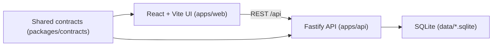

# FINEOS AdminSuite Mock

A deterministic, end-to-end mock of FINEOS AdminSuite: notification intake,
generated Absence/GDC case creation, case search, and case execution. The UI
reproduces the supplied AdminSuite screenshots at their captured viewports; a
Fastify API and SQLite database back the workflow with no real authentication
or third-party dependency.

## Architecture



One npm workspace, three packages:

| Package | Role |
| --- | --- |
| `apps/web` | React 19 + Vite 8 SPA. AdminSuite shell, intake wizard, case/party/lookup pages, `react-router-dom` routing. |
| `apps/api` | Fastify 5 + `better-sqlite3`. Boundary → Control → Entity layout: `src/boundary` (routes, validation), `src/application` (use-case services), `src/domain` (pure domain logic), `src/infrastructure` (SQLite schema/seed/repositories). |
| `packages/contracts` | Shared TypeScript request/response/error/domain types consumed by both `apps/web` and `apps/api` (no build step; resolved directly from source via the workspace). |

Sign-in is a deterministic mock (shared password, no real identity provider —
see the `ponytail:` comment in `apps/api/src/application/session-service.ts`).

### Agent-first mode (default) and the automation shortcuts

By default the mock runs in **agent-first mode**: it exposes only the manual
case workflow (case tabs, forms, provider/diagnosis lookups, deterministic
lookup pages) and leaves every case-execution decision to the external
Playwright agent. Nothing auto-fills or auto-runs the process.

Concretely, when the flag is off:

- the **Run Case Execution** button and its execution outcome/error banners are hidden;
- `POST /api/cases/:caseId/execute` and `GET /api/cases/:caseId/execution-runs/:runId` are **not registered** — they return an ordinary `404` because the routes do not exist.

The one-and-only way to turn the automation shortcuts on in production is to
edit this single source constant and rebuild/restart:

```ts
// packages/contracts/src/feature-flags.ts
export const AUTOMATION_SHORTCUTS_ENABLED = true; // default is false
```

There is deliberately **no** env var, query string, `localStorage`, API, or UI
toggle — the constant is the entire control surface. API unit tests may pass an
explicit code-level `automationShortcutsEnabled` option to `buildApp` (defaulting
to the shared constant) to cover the orchestration branch; the production server
passes nothing and inherits the shared constant.

> **Warning:** default agent mode intentionally leaves case-execution decisions
> (component scope, condition/diagnosis resolution, provider attach/skip) to the
> external Playwright agent. Enabling the shortcuts bypasses that hand-off and
> lets the built-in `execute` orchestration make those decisions instead.

### Data flow

1. Sign in creates a local mock session.
2. A party (customer) is searched and a notification draft is created against it.
3. The 14-stage intake wizard saves each section (`PUT /api/notifications/:draftId/sections/:sectionKey`).
4. Submission (`POST /api/notifications/:draftId/submit`) atomically allocates the notification root ID and activates its Absence and/or GDC component cases. Resubmission returns the existing references instead of duplicating.
5. Case Search finds the generated root ID; `POST /api/cases/:caseId/execute` evaluates case existence, intake coverage, leave reason, condition description, component scope, and provider availability, then updates the Absence/GDC tracks and returns a completed or escalated status. Concurrent execution of the same case is guarded and returns `execution_in_progress`.

## Prerequisites

- Node.js 22+ (matches the `Dockerfile` base image; the workspace uses native ESM and `better-sqlite3` prebuilt bindings).
- npm (installed with Node).

## Install

```bash
npm install
```

Installs all three workspaces (`apps/web`, `apps/api`, `packages/contracts`) from the single root lockfile.

## Database reset

```bash
npm run db:reset
```

Recreates `data/fineos.sqlite` from `apps/api/src/infrastructure/schema.sql` and reseeds it (Erica Alexander / David Hunter / Travis Larson fixtures — see [Fixtures](#fixtures)). Safe to run any time; it is destructive only to the dev database file, not to `data/fineos.e2e.sqlite` or `data/fineos.visual.sqlite` used by the test suites.

The API also resets and reseeds its configured database file automatically on every process start (`apps/api/src/server.ts`), so a manual reset is only needed to restore fixtures mid-session without restarting the server.

## Running the app locally

Two processes, in two terminals:

```bash
# Terminal 1 — API on http://localhost:3001
npm run start --workspace apps/api

# Terminal 2 — Web on http://localhost:5173 (Vite proxies /api to :3001)
npm run dev
```

Open `http://localhost:5173`.

### Login

The sign-in form is pre-filled with the fixture email; only the password needs to be typed:

- **Email:** `jekwueme@unum.com` (any non-empty value is accepted — only the password is checked)
- **Password:** `fineos`

## Build

```bash
npm run build
```

Runs `build --workspaces --if-present`: `apps/web` runs `tsc --noEmit && vite build` (output in `apps/web/dist`); `apps/api` runs `tsc --noEmit`; `packages/contracts` has no build step (consumed as source).

## Lint

```bash
npm run lint
```

ESLint (flat config, `typescript-eslint` recommended rules) over the whole repo, excluding `dist`, `node_modules`, and `data`.

## Unit tests

```bash
npm test
```

Runs Vitest across `apps/*/{src,test}` and root `{src,test}` — domain scenario tests (`apps/api/test/case-execution-domain.test.ts`, `notification-domain.test.ts`), API integration tests against a temporary SQLite database (`apps/api/test/api.test.ts`, `intake-lifecycle.test.ts`, `database.test.ts`), and frontend component tests (`apps/web/src/features/access/access.test.tsx`).

## End-to-end tests

```bash
npm run test:e2e
```

Playwright (`playwright.config.ts`) boots a dedicated API on port `3101` (`data/fineos.e2e.sqlite`, `FINEOS_TEST_MODE=1`) and the web dev server on port `5174`, then runs `tests/e2e/*.spec.ts`:

- `full-lifecycle.spec.ts` — sign in → complete Erica's intake (Leave + GDC) → submit → search the generated case → execute it.
- `negative-branches.spec.ts` — unselected component scope, duplicate submit, missing case, ineligible intake, missing condition description, provider skip, concurrent execution.
- `control-audit.spec.ts` — every visible enabled control across access, search, master plan, party, intake (including every calendar day and lookup result), confirmation, case, and lookup screens is inventoried and asserted to produce a state change, dialog, navigation, or persisted mutation.

Each test resets the e2e database via `POST /api/test/reset` (an auto-fixture in `tests/e2e/fixtures.ts`) and fails on any browser console error/warning.

## Visual tests

```bash
npm run test:visual
```

Playwright (`playwright.visual.config.ts`) boots a dedicated API on port `3102` (`data/fineos.visual.sqlite`) and web dev server on port `5175`, then `tests/visual/fineos.visual.spec.ts` visits every one of the 64 states in `tests/visual/reference/manifest.json`, renders it at its exact captured viewport, and pixel-compares it against the reference PNG using `pixelmatch`. Results (per-state actual/diff PNGs and `report.json`) are written to `tests/visual/results/`. See [`VISUAL_DIFFS.md`](./VISUAL_DIFFS.md) for the thresholds and documented residual differences — all 64 states currently pass.

```bash
open tests/visual/results/report.json   # per-state ratio, threshold, pass/fail
```

## Routes

| Route | Page | Notes |
| --- | --- | --- |
| `/` | — | Redirects to `/login`. |
| `/login` | `LoginPage` | Mock sign-in. |
| `/dashboard` | `DashboardPage` | My Cases / Team Cases widgets, global search. |
| `/parties/:partyId`, `/parties/:partyId/:view` | `PartyPage` | Profile, contact, communication-preferences views. |
| `/master-plans/:planId/members` | `MasterPlanPage` | Master plan member list. |
| `/notifications/:draftId/intake/:step` | `IntakeWizard` | 14-stage intake (see `apps/web/src/features/intake/intake-steps.ts` for the step slugs). |
| `/notifications/:draftId/confirmation` | `ConfirmationPage` | Post-submission summary and generated case links. |
| `/cases/:caseId`, `/cases/:caseId/:tab` | `CasePage` | Notification/Absence/GDC case record, tabs, execution trigger. |
| `/lookups/:source` | `LookupPage` | Deterministic in-app stand-ins for uKnow, Google-style ICD-10 search, and ICD10Data.com — the journey never depends on external services. |

### API endpoints (`apps/api`, prefixed `/api`)

`POST /session` · `GET /parties/search` · `GET /parties/:partyId` · `PATCH /parties/:partyId/contact` · `POST /providers` · `POST /parties/:partyId/notifications` · `PUT /notifications/:draftId/sections/:sectionKey` · `POST /notifications/:draftId/submit` · `GET /cases/search` · `GET /cases/:caseId` · `POST /test/reset` (test-mode only, gated by `FINEOS_TEST_MODE=1`).

The automation-shortcut endpoints `POST /cases/:caseId/execute` and `GET /cases/:caseId/execution-runs/:runId` are only registered when `AUTOMATION_SHORTCUTS_ENABLED` is `true` (see [Agent-first mode](#agent-first-mode-default-and-the-automation-shortcuts)); in the default agent mode they return `404`.

Every endpoint validates at the boundary and returns a typed `{ ok: true, value }` / `{ ok: false, error }` body (`packages/contracts/src/result.ts`); business failures (`party_not_found`, `unknown_section`, `already_submitted`, `case_not_found`, `execution_in_progress`, `case_already_terminal`, `invalid_decision_override`, …) are typed error codes, never thrown exceptions.

## Fixtures

Seeded by `apps/api/src/infrastructure/seed.ts` (also used by `db:reset`):

| Party | Role | Notification | Component(s) | Notes |
| --- | --- | --- | --- | --- |
| Erica Alexander (Fifth Third Bank National Association) | Insured | `NTN-165775` | Leave (`NTN-165775-ABS-01`) + GDC (`NTN-165775-GDC-02`) | Used by the intake walkthrough; the intake E2E flow. |
| David Hunter (ACEDEX) | Insured | `NTN-159898` | Leave (`NTN-159898-ABS-01`, condition: torn ligament in knee) + GDC (`NTN-159898-GDC-02`, diagnosis `O80`) | Used by the case-execution walkthrough; `O80` is a preserved source inconsistency (diagnosis code doesn't match the knee narrative), kept intentionally rather than "corrected". |
| Travis Larson | Medical provider | — | — | Attached to David's GDC case during execution's provider step. |

Newly created notifications (via the UI or `POST /api/parties/:partyId/notifications`) are internally coherent and can immediately enter case execution through their generated root case ID — see `full-lifecycle.spec.ts`.

## End-to-end walkthrough

Manual path exercising the full generated-case journey (mirrors `tests/e2e/full-lifecycle.spec.ts`):

1. Start the API and web dev servers (see [Running the app locally](#running-the-app-locally)) and open `http://localhost:5173`.
2. Sign in with `jekwueme@unum.com` / `fineos`.
3. From the dashboard, open search, switch to the **Party** tab, and find **Erica Alexander**.
4. From Erica's profile, start a new notification. Step through the intake wizard: Notification Details → Occupation Details → Type of Request → Reason for Absence → Leave Periods → Work Schedule → Additional Absence Details → Disability Incident Details → Policy Details → Earnings Details → Medical Details (select **Leave and GDC** in Notification Options to activate both component tracks).
5. Submit. The confirmation page shows the generated root notification ID plus its `-ABS-01` and `-GDC-02` case links.
6. Open search again, switch to the **Case** tab, and search for the generated root ID (e.g. `NTN-xxxxxx`). Select it from the results and confirm.
7. Navigate to `/cases/<generated-id>/general`. In the default **agent-first mode** the case opens as a manual record with no **Run Case Execution** button — this is the hand-off point where the external Playwright agent drives the case (working the tabs, resolving the condition/diagnosis, and attaching a provider itself).
8. To instead exercise the built-in orchestration, enable the automation shortcuts (see [Agent-first mode](#agent-first-mode-default-and-the-automation-shortcuts)), rebuild/restart, then click **Run Case Execution** and confirm the "Case execution completed" banner mentions **Absence and GDC**.

## Docker (single container)

```bash
docker build -t fineos-adminsuite-mock .
docker run -p 3001:3001 fineos-adminsuite-mock
```

Builds the web SPA and runs the API, which serves both `/api` and the static SPA on one port (`FINEOS_WEB_DIST`). SQLite is recreated and reseeded on every container start, so the image needs no volumes.

## Project structure

```
apps/
  web/         React SPA (features/, components/fineos/ shared shell, app/router.tsx, app/api.ts)
  api/         Fastify API (boundary/, application/, domain/, infrastructure/)
packages/
  contracts/   Shared TypeScript types and Result helpers
tests/
  e2e/         Playwright functional + control-audit specs
  visual/      Playwright visual-diff spec, reference PNGs, manifest, results
scripts/       Reference-image extraction and one-off PNG measurement helpers
docs/superpowers/  Design spec and implementation plan
data/          SQLite files (dev / e2e / visual) — git-ignored except .gitkeep
```

## Further reading

- [`VISUAL_DIFFS.md`](./VISUAL_DIFFS.md) — visual-fidelity thresholds, methodology, and every documented residual difference.
- [`docs/superpowers/specs/2026-07-20-fineos-adminsuite-mock-design.md`](./docs/superpowers/specs/2026-07-20-fineos-adminsuite-mock-design.md) — design spec.
- [`docs/superpowers/plans/2026-07-20-fineos-adminsuite-mock.md`](./docs/superpowers/plans/2026-07-20-fineos-adminsuite-mock.md) — implementation plan and task checklist.
