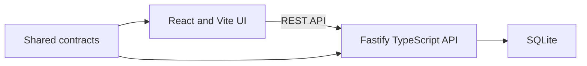

# FINEOS AdminSuite Mock Design

## Goal

Build a deterministic, end-to-end FINEOS AdminSuite mock in `/Users/abubakar/Desktop/fineos-app`. The UI must reproduce the supplied AdminSuite screenshots at their captured viewports, while a lightweight Fastify API and SQLite database support notification intake, generated case creation, case search, and ES case execution.

## Sources of Truth

- UI and observed interactions:
  - `/Users/abubakar/Desktop/fineos-mock/FINEOS_notification_intake_walkthrough.html`
  - `/Users/abubakar/Desktop/fineos-mock/FINEOS_case_execution_walkthrough.html`
- Process routing and decisions:
  - `/Users/abubakar/Desktop/fineos-mock/aop-full/discovery_aop.json`
  - `/Users/abubakar/Desktop/fineos-mock/aop-full/decision_prompts.json`
  - `/Users/abubakar/Desktop/fineos-mock/ES_Markup_Dev08_2.bpmn`
- Screenshot pixels take precedence for visual appearance. The full AOP takes precedence for runtime routing.

The walkthrough HTML around the screenshots is documentation chrome and will not be reproduced.

## Scope

The mock covers:

1. Sign in and dashboard.
2. Party/customer search and profile.
3. Fourteen-stage notification intake.
4. Conditional Leave and GDC intake sections.
5. Notification submission and generated root/ABS/GDC case IDs.
6. Case search and notification documents/case map.
7. Claimant profile and contact update.
8. Absence and GDC component processing.
9. Deterministic ICD-10 lookup, diagnosis entry, and provider attachment.
10. Every branch and terminator represented by the full AOP.

The mock stops where the execution walkthrough stops. Adjudication, payment, and closure are out of scope. Visible controls whose resulting screens were not captured will receive plausible, deterministic behavior in the existing screen system; they will not introduce new payment or adjudication domains.

## Architecture

One npm workspace:

- `apps/web`: React, Vite, routing, AdminSuite components, Playwright tests.
- `apps/api`: Fastify, SQLite access, migrations, seed/reset commands, API tests.
- `packages/contracts`: shared TypeScript request, response, error, and domain types.
- `tests/visual/reference`: PNG references extracted from the supplied HTML.
- `tests/visual/results`: generated renders and visual diffs.

There is no real authentication service. Sign-in is deterministic and creates a local mock session.

## Frontend Design

### Target Viewports

- Notification intake primary viewport: `1500×945`.
- Case execution primary viewport: `1450×905`.
- Login, search, modal, and lookup reference states retain their captured dimensions when visually tested.

The application receives a responsive fallback only after target viewport fidelity is established.

### Shared AdminSuite Components

- Product header, application navigation, breadcrumbs, and record header.
- Dashboard widget grid.
- Search dialog with Case, Party, and Recent tabs.
- Party and case record shells with multi-tab navigation.
- Data tables, pagination, empty states, status badges, and overdue notices.
- Intake wizard form shell with Previous, Next, Close, and Reset controls.
- Text fields, selects, open dropdown states, toggles, radios, date picker, and type-ahead.
- Modal dialogs for absence periods, provider search, Add Person, and Add Medical Provider.
- Case map hierarchy.
- Diagnosis and provider panels.
- Submission confirmation and generated case references.

Components use semantic controls, keyboard navigation, visible focus, labels, and dialog focus management.

### Routes and States

The 14 intake stages and 11 execution stages each receive a route. Multiple screenshots in one stage become named UI states on that route, such as dropdown-open, modal-open, selected, saved, scrolled, or read-only.

The in-app lookup routes reproduce the observed uKnow, Google-style, ICD reference, and diagnosis lookup states so the journey never depends on external services.

### Data Fidelity

Seed fixtures preserve the screenshot values for:

- Erica Alexander / Fifth Third Bank / NTN-165775 intake.
- David Hunter / ACEDEX / NTN-159898 execution.
- Travis Larson provider.

Known source inconsistencies, including the knee narrative with diagnosis `O80`, are preserved in exact screenshot fixtures. Newly created notifications remain internally coherent and can immediately enter case execution through their generated root case ID.

## Process Flow

1. The user selects a party and creates a notification draft.
2. Each wizard stage saves its section data.
3. Notification Options resolves intake component scope.
4. Leave and/or GDC sections are completed.
5. Submission atomically allocates the notification root ID and activated subcases.
6. Case Search finds the generated root ID.
7. Execution evaluates case existence, intake coverage, leave reason, condition availability, case components, and provider availability.
8. Active Absence/GDC tracks update their records and synchronize.
9. The run completes or reaches the appropriate escalation terminal.

Conditional AOP forks are implemented as activated-track synchronization: joins wait only for tracks activated by their fork.

## API Design

Minimal endpoints:

- `POST /api/session`
- `GET /api/parties/search`
- `GET /api/parties/:partyId`
- `PATCH /api/parties/:partyId/contact`
- `POST /api/parties/:partyId/notifications`
- `PUT /api/notifications/:draftId/sections/:sectionKey`
- `POST /api/notifications/:draftId/submit`
- `GET /api/cases/search`
- `GET /api/cases/:caseId`
- `POST /api/cases/:caseId/execute`
- `GET /api/cases/:caseId/execution-runs/:runId`

Every endpoint validates at the boundary and returns typed success or error bodies. Expected business failures use discriminated error values rather than exceptions.

## SQLite Design

Tables:

- `party`
- `notification`
- `absence_case`
- `absence_period`
- `gdc_case`
- `case_execution_run`

Notification owns its Absence and GDC component records. Party/provider relationships are stored by ID. Execution runs reference notification IDs and store decision results and terminal status.

Submission is one transaction: allocate root ID, mark submitted, create activated component cases, and return confirmation. Execution uses an in-progress run row as a concurrency guard and commits decision results and component updates atomically.

Repeated submission returns the existing generated references instead of creating duplicates. Concurrent execution of the same case returns `execution_in_progress`.

## Errors and Validation

Typed API errors include:

- `invalid_credentials`
- `party_not_found`
- `unknown_section`
- `invalid_section`
- `component_scope_required`
- `already_submitted`
- `case_not_found`
- `execution_in_progress`
- `case_already_terminal`
- `invalid_decision_override`

The frontend renders FINEOS-style inline validation, empty states, not-found states, and escalation statuses. Error visuals are plausible extensions because no captured error state exists; they reuse observed typography, spacing, borders, and color hierarchy.

## Verification

### Automated behavior

- Scenario-based domain tests for Leave-only, GDC-only, both-component, and invalid component scopes.
- Negative tests for duplicate submit, missing case, ineligible intake, missing condition description, provider skip, invalid overrides, and concurrent execution.
- API integration tests use a temporary SQLite database.
- Playwright tests exercise login through intake, submission, generated-case search, execution, all AOP branches, modals, tabs, validation, and keyboard interactions.

### Visual fidelity

- Extract all 64 supplied reference PNGs from the walkthrough HTML.
- Render every captured state at its original dimensions.
- Compare each render against its source PNG and save diff artifacts.
- Fix mismatches in hierarchy, geometry, typography, color, and decorative detail, in that order.
- Do not claim exact fidelity while unexplained visual differences remain.

## Completion Criteria

- Frontend build, API build, lint, domain tests, API tests, and Playwright tests pass.
- Database reset and seed are deterministic.
- The generated intake case can be searched and executed end to end.
- All process branches and joins complete without deadlock.
- Every supplied screen has a visual comparison.
- Every visible control has deterministic behavior.
- Remaining visual differences, if any, are explicitly documented.
